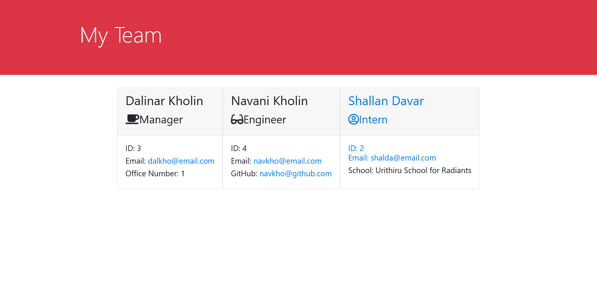

# OOP Challenge: Team Generator

## Descriptiton

This app uses Javascript, Node, Inquirer, and FS to take user input and build a custom html page for their team. It's built with a focus on Object Oriented Programming to make it's code less repetitive.

## Table of Contents

- [Installation](#installation)
- [Usage](#usage)
- [Credits](#credits)
- [License](#license)

## Installation

To use this app you must download the source code. Use Node to run the app by typing into the Command Line "node index.js". This command must be typed in at this files root directory.

## Usage

To use this app follow the Installation directions above then answer the prompts that will appear in the Command Line. Once you've finished building your team select "All Done". To view the WebPage open the index.html file that was created in your browser.

## Credits

There were no other collaborators. To view my Github profile go [here](https://github.com/D-Whipp).

## License

[MIT](https://choosealicense.com/licenses/mit/)

## Badges

